# P1 - Anatomia Humana

Neste capítulo estarão contidas as notas de aula da disciplina Anatomia Humana.

|Data|Tópicos Abordados|
|:--|:--|
|30/10/2022|- Versão inicial do documento|

## Atlas de Anatomia Humana

* QUADROS DE MÚSCULOS, ARTICULAÇÕES E NERVOS: Acesse o link (https://bit.ly/3ggvKls).

## Nota de Aula nº 01

|Data|Tópicos Abordados|
|:--|:--|
|01/08/2022|-Definição da Anatomia<br>- História da Anatomia|

A primeira aula foi expositiva e tratou da definição da Anatomia, disciplina e conhecimento científico, e da sua história.

## Nota de Aula nº 02 

|Data|Tópicos Abordados|
|:--|:--|
|08/08/2022|Divisões do corpo humano;Abreviações diversas;Termos e expressões anatômicas diversas;Posição Anatômica;Planos de Secção; Planos de Delimitação;Termos de Posição e Direção|

Neste dia @PROF-SOUSA-2022 tratou sobre os assuntos a seguir. Adicionalmente, resumimos o capítulo 1 do livro @MARIEB-WILHELM-MALLAT-2014.

### Divisões do Corpo Humano

1. Cabeça
     * Crânio
     * Face ( da sobrancelha ao mento )
2. Pescoço
    * Região Posterior
        * Nuca
    * Região Anterior
3. Tronco
    * Tórax
    * Abdome
    * Pélvis
4. Membros Superiores
    * Raiz do membro superior
    * Braço
    * Antebraço
    * Mãos
        * Carpo
        * Metacarpo
        * Dedos das mãos
5. Membros Inferiores
    * Raiz do membro Inferior
    * Coxa
    * Perna
    * Pés
        * Tarso
        * Metatarso
        * Dedos dos pés

```{r echo=FALSE, fig.show="hold", out.width="90%", fig.align = "center", fig.cap="Posição Anatômica e Termos Regionais"}
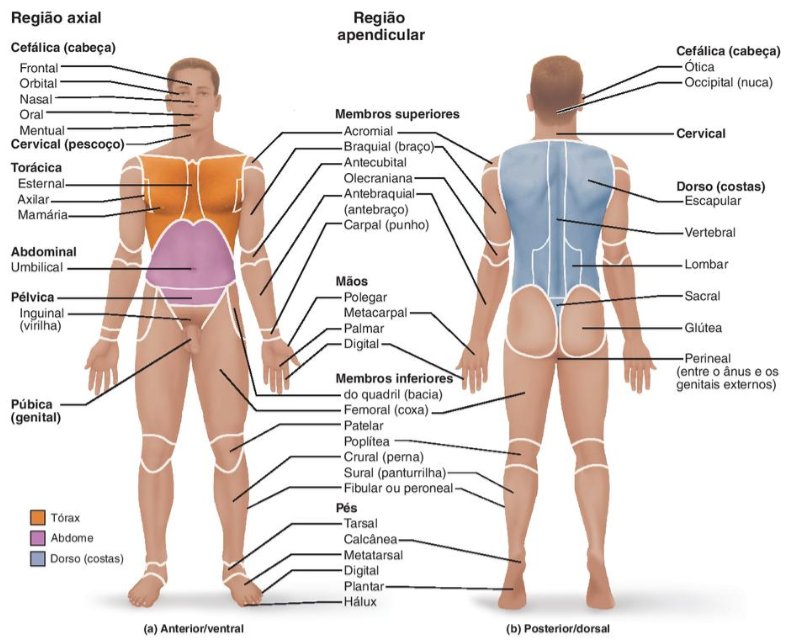
```

### Abreviações Diversas

* M. = músculo
* Mm. = músculos
* V. = veia
* Vv. = veias
* A. = artéria
* Aa. = artérias

### Termos e Expressões Anatômicas Diversas

1. **Agenesia**: significa ausência;
2. **Sutura**: são linhas que dividem os ossos da cabeça;
3. **Epônimos**: São estruturas anatômicas que receberam nomes de seus "descobridores". Não são mais utilizados desde 2012 na Anatomia.
4. **Nomenclatura anatomia**: É o dialeto usado diariamente na Anatomia. É o jargão científico da Anatomia. É a linguagem, são os termos utilizados rotineiramente.

### Posição Anatômica

É universal e padrão.

1. Ereta (posição reta);
2. Bípede (sobre os dois pés);
3. Ortostático (em pé e parada);
4. Olha para frente;
5. Membros superiores estendidos e <u>**juntos**</u> ao corpo;
6. Palmas das mãos voltadas para frente;
7. Membros inferiores estendidos e <u>**juntos**</u> ao corpo;
8. Pés fixados ao chão;

> **Observação 1**: Enumere as estruturas anatômicas de fora para dentro.

### Planos

#### Planos de Secção {-}

```{r echo=FALSE, fig.show="hold", out.width="90%", fig.align = "center", fig.cap="Planos de Secção"}
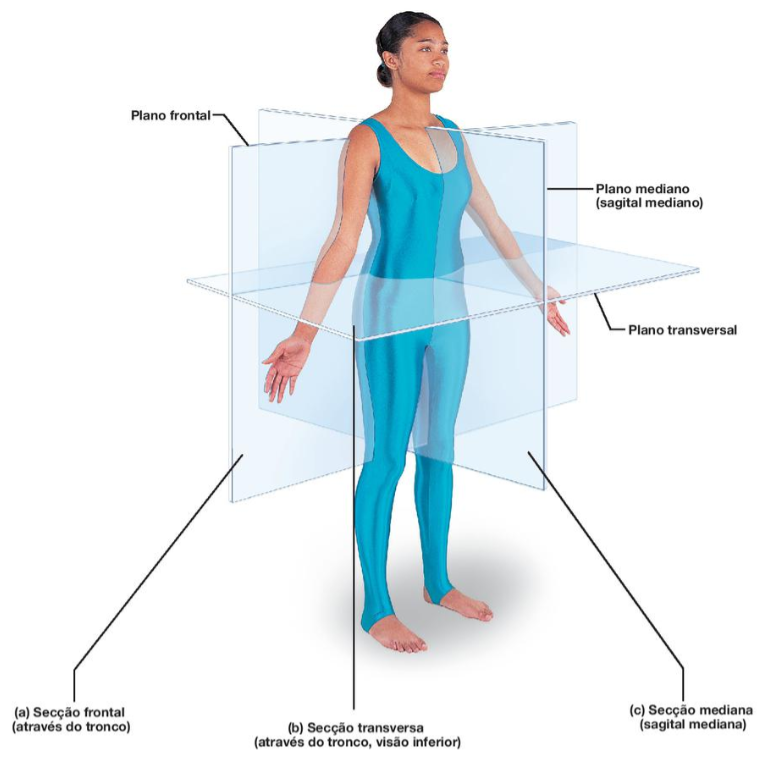
```

 Realizam cortes imaginários. Originam os <amarelo>planos de delimitação</amarelo>. Pergunte-se onde o corte foi iniciado?
 
* Plano Sagital Mediano ( <amarelo>corte imaginário</amarelo> que divide em duas metades: lado direito e lado esquerdo) 
* Plano Coronal ou Frontal Média ( <amarelo>corte imaginário</amarelo> que divide em duas metades: lado anterior e lado posterior ) 
* Plano Transversal ( <amarelo>corte imaginário</amarelo> que divide em duas metades: superior e inferior ) 

#### Planos de Delimitação {-}

São 6 lados. Um para cada lado do corpo e são originários dos **planos de seção**.

* Plano Anterior ou Plano Ventral
* Plano Posterior ou Plano Dorsal
* Plano Superior ou Plano Cefálico
* Plano Inferior ou Plano Podálico
* Plano Lateral Direito
* Plano Lateral Esquerdo

> **Exemplo de questão de prova 1**: Os <u>planos de secção</u> dividem o corpo em quantas partes ?
> > **Resposta**: Duas. Sempre duas.

> **Observação 2**: Nas provas, a professora requer que sejam mencionados os planos <u>de forma completa</u>, juntamente com seus nomes alternativos. 
> > **Exemplos 3.1**: Plano de delimitação anterior ou dorsal, Plano de delimitação posterior ou dorsal, Plano de delimitação superior ou cefálico, Plano de delimitação inferior ou podálico.
> >  **Exemplos 3.2**: Plano de secção sagital anterior ou dorsal, Plano de secção coronal ou frontal média, Plano de secção transversal

> **Observação 3**: Os planos são muito referenciados em exames de imagens

### Termos de Posição e Direção

#### Termos de Posição
   
1. Quando a referência é **o meio** do corpo
    * Mediana ( meio )
    * Medial ( próximo ao meio )
    * Intermédia
    * Lateral ( posição mais distante da mediana )
2. Quando a referência é **a raiz** ( onde a estrutura começa )
    * Proximal ( a referência é a raiz )
    * Média
    * Distal ( mais distante da raiz )
3. Quando a referência é uma **cavidade**
    * Interno
    * Externo
 4. Quando a referência é a **camada**
	* Superficial
	* Profunda

#### Termos de Direção (ver anotações da aula 15/08/2022)

### Referências

[1]: SOUZA, Cláudia Maria. **Introdução à Anatomia Humana**. Anatomia Humana. Notas de aula (08/08/2022), Faculdade Três Marias, Paraíba 2022.

[2]: MARIEB, Elaine N.; WILHELM, Patricia Brady; MALLAT, Jon. **Anatomia Humana**. 7.ed. São Paulo:Pearson, 2014.

## Nota de Aula nº 03

|Data|Tópicos Abordados|
|:--|:--|
|15/08/2022|Termos de Posição e Direção;Variação Morfológica;Princípios de Construção do Corpo Humano;Osteologia;Função dos Ossos|

### Termos de Posição e Direção

* Termos de Posição ( veja aula 08.08.2022 )
* Termos de Direção

### Variação Morfológica

Todas as variações morfológicas são **congênitas**. Os tipos de variações morfológicas são:

1. **Variação Anatômica**: É a variação morfológica que <amarelo>não causa prejuízo para o funcionamento<amarelo> do corpo humano. É uma variação peculiar e pequena que não causa disfunção. Não há comprometimento funcional do órgão.

> **Exemplos**: 
> > * Destrocardia: Coração mais voltado para o lado direito.
> > * Fibras extranuméricas do músculo deltóide.

2. **Anomalia**: É a variação morfológica que <amarelo>compromete funcionalmente<amarelo> o corpo humano.

> **Exemplos**:
> > * Lábio leporino: Fenda, geralmente no lábio superior, que pode comprometer o palato (céu da boca) causando alterações respiratórias, alimentares e de fonação.
> > * Polidactilia: Dedos extranuméricos, nas mãos ou nos pés.
> > * Focomelia: A focomelia é uma anomalia congênita que impede a formação normal de braços e pernas. Caracteriza-se pela aproximação ou encurtamento dos membros do feto, tornando-os semelhantes aos de uma foca.
> > * Gêmeos siamesses
> >   * compartilhado pela cabeça;
> >   * compartilhado lateralmente;
> >   * compartilhado anteriormente

3. **Aberrações ou monstruosidades**: São variações morfológicas que <amarelo>prejudicam demasiadamente<amarelo> as funções corporais. São <amarelo>incompatíveis com a vida<amarelo>.

> Exemplos:
> > * Anencéfalia

**Outros Termos Citados em Aula**: Destro = direita / Sinistro = esquerda

### Princípios de Construção do Corpo Humano

São quatro os princípios de construção do corpo humano:

1. **Antimeria**: É o princípio que afirma que o corpo é formado por <amarelo>antímeros (metades semelhantes)<amarelo>. O antímero direito é semelhante/parecido com o antímero esquerdo.
2. **Paquimeria**: É o princípio que afirma que o corpo é formado por <amarelo>tubos<amarelo>. Ex. tubo digestório, tubo neural
3. **Metameria**: É o princípio que afirma que o corpo é formado por <amarelo>estruturas sobrepostas<amarelo>. Ex. costelas, coluna vertebral.
4. **Estratigrafia** ou **Estratificação**: É o princípio que afirma que o corpo é formado por <amarelo>camadas<amarelo>.

### Osteologia

É a ciência que estuda os ossos (Aprox. 206 ossos). Os ossos quando se articulam formam o esqueleto. O esqueleto é a junção dos ossos do corpo. 

#### Tipos

O esqueleto é dividido:
* **Esqueleto Axial**: Ossos localizados no centro do corpo.
   * Cabeça
   * Pescoço
   * Tronco
 * **Esqueleto Apendicular**: Ossos dos membros superiores e inferiores com suas raízes.
   * Membros Superiores
       * As raizes dos membros superiores: Duas Clavículas e Duas Escápulas
   * Membros Inferior
       * As raizes dos membros inferiores:  Dois Ossos do Quadril ( Ilíaco Direito e Ilíaco Esquerdo)    

#### Função

* Sustentação do corpo humano;
* Proteção de órgãos vitais;
  * Caixa torácica (pulmões e coração) / caixa craniana (encéfalo)
* Produção de células sanguíneas (função hematopoiética)
  * médula óssea
* Reserva de sais minerais
* Alavancas

### Referências

[1]: SOUZA, Cláudia Maria. **Introdução à Anatomia Humana**. Anatomia Humana. Notas de aula (15/08/2022), Faculdade Três Marias, Paraíba 2022.

[2]: SOUZA, Cláudia Maria. **Osteologia (1/2)**. Anatomia Humana. Notas de aula (15/08/2022), Faculdade Três Marias, Paraíba 2022.

## Nota de Aula nº 04

|Data|Tópicos Abordados|
|:--|:--|
|22/08/2022|TAula prática no laboratório de Anatomia - Sistema Esquelético|

### Ossos da Cabeça

### Ossos da Face ( Parte Anterior )

* Zigomático (2)
* Nasais (2)
* Vômer
* Conchas Nasais (2)
* Maxilar (2)
* Mandíbula
* Palatino (2)
* Lacrimal (2)
* Martelo
* Bigorna
* Estribo

### Ossos do Crânio ( Parte Posterior )

* Frontal
* Parietal (2)
* Occipital
* Temporal (2)
* Esfenóide
* Etimóide

### Coluna Vertebral

É dividida em 05 regiões com um total de 26 ossos.

* Região Cervical
  * 07 Vértebras ( I a VII )
* Região Dorsal ou Toráxica
  * 12 Vértebras ( VIII a XIX )
* Região Lombar
  * 05 Vértebras ( XX a XXIV )
* Região Sacral
  * Osso Sacral
* Região Coccigeana
  * Osso Cóccix

### Membros Superiores

```{r echo=FALSE, fig.show="hold", out.width="90%", fig.align = "center", fig.cap="Ossos do Braço"}
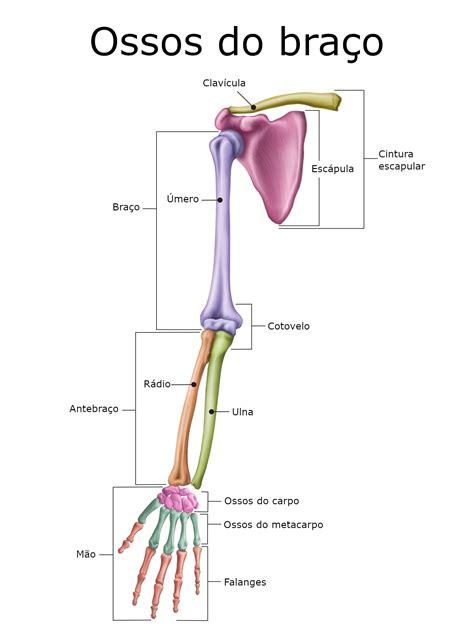
```

* Raiz
	* Clavícula (2)
	* Escápula (2)
* Braço
	* Úmero (2)
* Antebraço
	* Rádio (2 **<amarelo>laterais<amarelo>**)
	* Ulna (2 mediais)
* Mão
	* <amarelo>Carpo<amarelo> 
		* Mais Proximal ( De fora para dentro )
			* Escafóide
			* Semilunar
		* Mais distal ( De fora para dentro )
			* Trapézio
			* Trapezóide
			* Capitato
			* Hamato
			* Piramidal
			* Pisiforme
	* <amarelo>Metacarpo<amarelo>
		* 1º, 2º, 3º, 4º e 5º metatarso (  de fora para dentro )
	* Falanges
		* 1º Falange (2 - polegar é mais distal)
			* Falange proximal
			* Falange distal
		* 2º, 3º 4º e 5º Falange (2 - de fora para dentro)
			* Falange proximal
			* Falange média
			* Falange distal   

```{r echo=FALSE, fig.show="hold", out.width="90%", fig.align = "center", fig.cap="Ossos da Mão"}
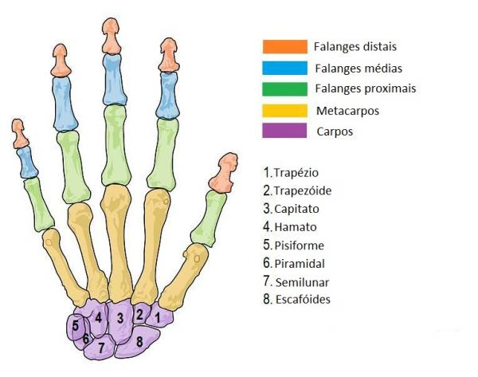
```

### Membros Inferiores

```{r echo=FALSE, fig.show="hold", out.width="50%", fig.align = "center", fig.cap="Ossos do Pé"}
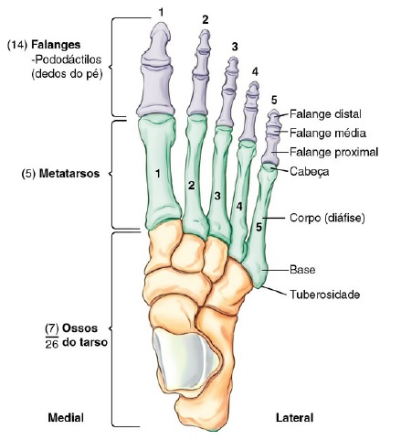
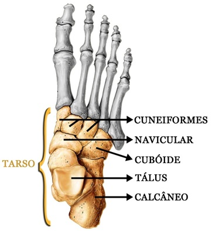
```

* Raiz
	* Osso do Quadril ou Osso Ilíaco
* Coxa
	* Fêmur (2)
* Perna
	* Tíbia
	* Fíbula (2 - mais lateral )
* Pé
	* Tarso
		* Calcâneo
		* Tálus
		* Navicular
		* Cubóide (mais lateral)
		* Cuneiforme Lateral
		* Cuneiforme intermédio
		* Cuneiforme medial
	* Metatarso
		* I, II, III, IV e V metatarso
	* Falanges
		* I, II, III, IV e V Falange Proximal
		* I, II, III, IV e V Falange Média
		* I, II, III, IV e V Falange Distal

### Referências

[1]: SOUZA, Cláudia Maria. **Osteologia (2/2)**. Anatomia Humana. Notas de aula (22/08/2022), Faculdade Três Marias, Paraíba 2022.

## Nota de Aula nº 05

|Data|Tópicos Abordados|
|:--|:--|
|29/08/2022|Sistema Articular;Sistema Muscular|

* **Observação**: Atentar para as anotações do que foi transcrito do que a professora falou na sala de aula. As imagens são ilustrativas e tem a função apenas de facilitar a visualização anatômica das estruturas mencionadas em sala.

### Sistema Articulatório

#### Definição

* Articulação: É o encontro de dois ou mais ossos.

#### Classificação das Articulações

As articulações classificam-se com base na sua mobilidade em **sinartroses**,**Anfiartroses** e **Sinoviais**.

#### Sinartroses

São articulações imóveis. Os ossos se encontram, mas não se movimentam. O nome desses tipos de articulações terão sempre o nome dos ossos envolvidos.

* Exemplos de Sinartroses
	* Articulação Frontoparietal ( Articulação entre os ossos frontal e parietal )
	* Articulação Temporoparietal (2)
	* Articulação Interparietal
	* Articulação Internasal
	* Articulação <amarelo>incudomalear (Entre os ossos martelo e bigorda )<amarelo>
	* Articulação <amarelo>incudoestapedial (Entre os ossos bigorna e estribo)<amarelo>

```{r echo=FALSE, fig.show="hold", out.width="90%", fig.align = "center", fig.cap="Ossos do Aparelho Auditivo"}
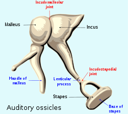
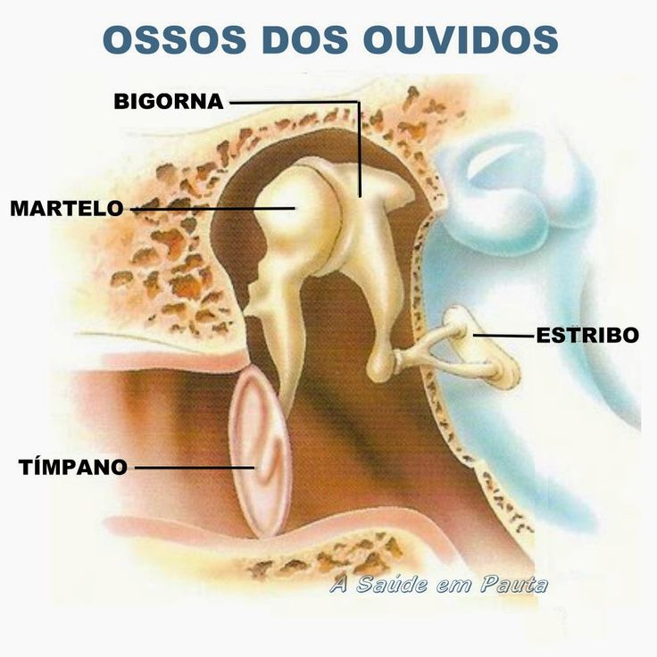
```

#### Anfiartrose

* São as articulações semimóveis. Todas as articulações desse tipo possuem um **disco verdadeiro** ou um **disco falso**(<amarelo>pseudodisco<amarelo>).
* **Discos verdadeiros** tem realmente a função de amortecer impactos. Exemplo: Articulação intercorpovertebral 
* **Discos falsos** (<amarelo>pseudodisco<amarelo>) não tem a função de amorcecer impactos.

	* Exemplos de Anfiartroses:
		* Articulação intercorpovertebral ( Articulação entre duas vértebras e o disco intervertebral que forma um disco verdadeiro, ou seja, que realmente tem a função de amortecer impactos )
		* Sínfise Púbica ( Articulação entre os dois ossos do quadril e o disco interpúbico. Esse disco é um disco falso, ou seja, que não tem função de amortecer impactos provocados pela gravidade )

#### Sinovial

* São articulações móveis. 

* Exemplos de articulações sinoviais:
	* Articulação temporomandibular ( ATM )
	* Ombro
	* Cotovelo
	* Punho
	* Articulação Interfalângica ( entre as falanges dos dedos das mãos )
	* Joelho
	* Quadril ( Entre a cabeça do fêmur e o acetábulo do osso ilíaco ou osso do quadril )
	* Tornozelo
	* Toda a coluna vertebral

### Sistema Muscular

#### Definição

Miologia é o estudo dos músculos.

> <amarelo>**Orientação da Professora para Prova**: Para prova, o aluno deverá memorizar o (1) **nome do músculo** e a (2) **localização** dele<amarelo>.

#### Classificação

* Os músculos classificam-se em três tipos: **lisos**, **estriados**(involuntários) e **esqueléticos** (voluntários).
	* O **músculo estriado esquelético** realiza contração rápida e vigorosa. É voluntário, ou seja, sua ação depende da nossa vontade.
	* O **músculo estriado cardíaco** é um músculo especializado, presente apenas no coração. Sua ação de contração é rápida, rítmica e contínua. Ele não para. Toda a musculatura cardíaca é músculo estriado cardíaco. E, <amarelo>apesar de ser músculo estriado, é **involuntário**<amarelo>.
	* O **tecido muscular liso** é um músculo involuntário. Está presente principalmente na parede de órgãos, como útero, bexiga, trato gastrointestinal, vasos sanguíneos, bronquíolos, entre outros. Assim como o anterior, ser involuntário é uma característica funcional muito importante

#### Músculos da Face

```{r echo=FALSE, fig.show="hold", out.width="90%", fig.align = "center", fig.cap="Músculos da Face"}
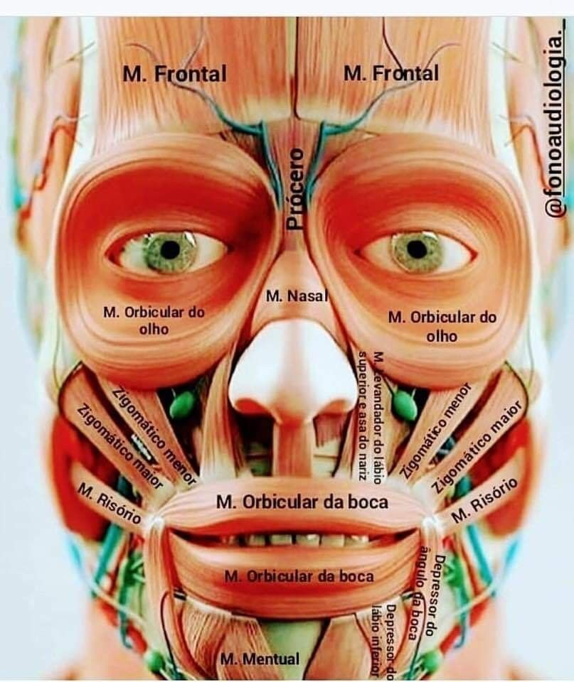
```

* Músculo Orbicular dos olhos
* Músculo Orbicular da boca ( ou dos lábios )
* Músculo Masseter ( o músculo da mastigação )
* Músculo Risório
* Músculo Bussinador
* Músculo Nasal

#### Músculos do Pescoço

```{r echo=FALSE, fig.show="hold", out.width="90%", fig.align = "center", fig.cap="Músculos do pescoço"}
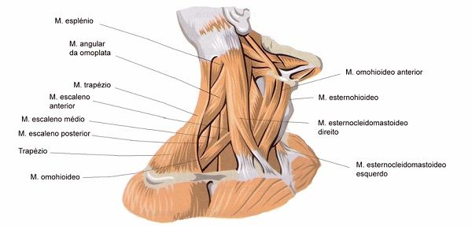
```

* Músculo Esternocleidomastóideo
	* Origina-se no osso esterno;
	* Passa pela lateral do pescoço;
	* Termina no processo mastóideo do osso temporal
* Músculo escaleno anterior
* Músculo escaleno médio
* Músculo escaleno posterior
* Músculo Trapézio

#### Músculos do Braço

```{r echo=FALSE, fig.show="hold", out.width="50%", fig.align = "center", fig.cap="Músculos dos Membros Superiores"}
knitr::include_graphics("imagens/Aula5-4-musculos-do-ombro-e-braco.png")
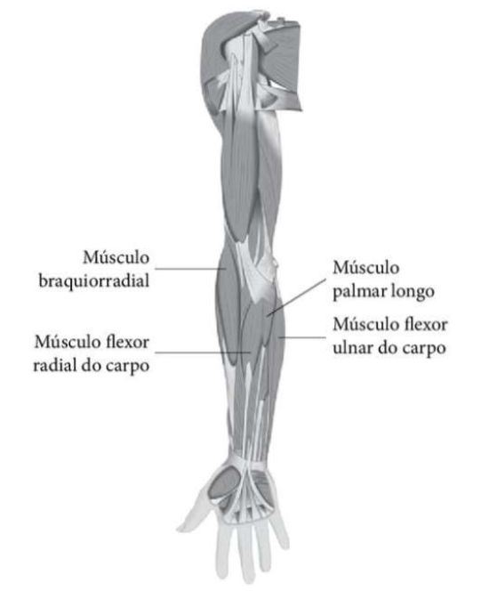
```

#### Músculos do Ombro

* Deltóide

> **Observação**: Embora não tenha escutado menção aos músculos abaixo, vou mencioná-los aqui:
> * Supraespinal
> * Infraespinal
> * Subescapular

#### Músculos do Braço

* Bíceps Braquial ( É um músculo flexor )
* Braquial ( Abaixo do Bíceps Braquial )
* Tríceps Braquial ( É um músculo extensor )

> Obs: 
> > Supinação = rotação externa
> >  Pronação= rotação interna

#### Músculos do Antebraço

> Não houve menção. Pelo menos que eu tenha ouvido.

#### Músculos da Mão

> Não houve menção. Pelo menos que eu tenha ouvido.

#### Músculos do Tórax

* Músculo Peitoral Maior (externo)
* Músculo Peitoral 1Menor (interno)

#### Músculos do Abdômen

<p align="center"> 
</img><br>
<b>Figura X</b> - Músculos do Abdome | Abdômen
</p>

```{r echo=FALSE, fig.show="hold", out.width="90%", fig.align = "center", fig.cap="Músculos do Abdome"}
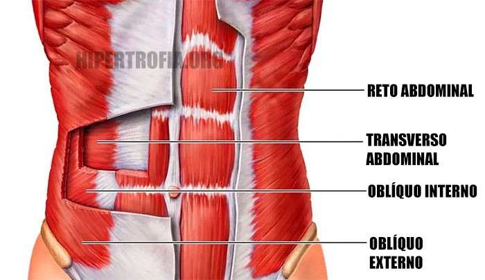
```

* Músculo Reto do Abdômen
* Músculo Oblíquo Externo ( mais externo )
* Músculo Oblíquo Interno
* Músculo Transverso ( mais interno )

#### Músculos da Região Glútea

* Músculo Glúteo Maior ( mais externo )
* Músculo Glúteo Médio
* Músculo Glúteo Menor ( mais interno )

#### Testículo

* Menor músculo **masculino**
	* Cremaster

#### Na orelha

* Menor músculo **feminino**
	* Estapédio

#### Músculos da Coxa

> Observação: Os maiores músculos do corpo estão situados na coxa.

* Região Anterior
	* Músculo Sartório ( um músculo fino e longo )
	* Músculo Quadríceps da Coxa ou femural ( É o nome que se dá a quatro músculos )
		* Músculo Vasto Medial
		* Músculo Vasto Intermédio ( fica por baixo do M. Reto Femural )
		* Músculo Vasto Lateral
		* Músculo Reto Femural ( fica anterior ao M. Vasto Intermédio)
* Região Posterior
	* Músculo Bíceps Femural
	* Músculo Semitendídeo
	* Músculo Semimembranáceo

#### Músculos da Perna

* Região Posterior
	* Músculos Tricepsural ( Panturilha - É o nome que se dá a três músculos )
		* Músculo Gastrocnêmio Medial
		* Músculo Gastrocnêmio Lateral
		* Músculo Sóleo ( dentro dos Gastrocnêmio Medial e Lateral )

### Referências

[1]: SOUZA, Cláudia Maria. **Sistema Articulatório**. Anatomia Humana. Notas de aula (29/08/2022), Faculdade Três Marias, Paraíba 2022.

[2]: SOUZA, Cláudia Maria. **Sistema Muscular**. Anatomia Humana. Notas de aula (29/08/2022), Faculdade Três Marias, Paraíba 2022.

[3]: SOUZA, Cláudia Maria. **Aula de revisão**. Anatomia Humana. Notas de aula (05/09/2022), Faculdade Três Marias, Paraíba 2022.

## Nota de Aula nº 06

|Data|Tópicos Abordados|
|:--|:--|
|29/08/2022|Sistema nervoso|

### Sistema Nervoso

<p align="center"> 
</img><br>
<b>Figura</b> - Estrutura do Neurônio
</p>

```{r echo=FALSE, fig.show="hold", out.width="90%", fig.align = "center", fig.cap="Neurônio"}
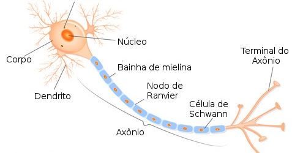
```

#### Anotações iniciais

* Temos aproximadamente 100 bilhões de neurônios, mas usamos aproximadamente 75% deles, o resto está dormindo e pode ser ativado a qualquer momento.
* A função dos neurônios é transmitir os impulsos nervosos  
* **Córtex** – Referente a parte externa de um órgão.
* **Medula** – Referente a parte interna de um órgão, mais para glândulas e sistema nervoso.
* **Parênquima** – Referente a parte interna de outros órgãos como respiratórios e digestórios.
* **Neurônios Espelhos** – é um neurônio imitador que é ativado quando vemos algo.

#### Funções das células do sistema nervoso

* **Função dos neurônios**
  * Transmitir impulsos nerosos
* **Função da Célula Glia**
  * Tem a função de **preencher os espaços entre os neurônios**, com intuito de **dar estabilidade** ao tecido nervoso.

#### Neurônios
  * **Corpo ou soma** - a parte mais volumosa da célula nervosa onde se localizam o núcleo
  * **Dendritos** – São filamentos curtos e numerosos
  * **Axônio** – São filamentos longos e únicos
  * **Bainha de Mielina** – é lipoproteica (formada de proteína e gordura) tem a função de transportar a mensagem do cérebro para o resto do corpo
  * **Botão terminal** – Aloja os neurotransmissores, importantes para a condução do estímulo elétrico

#### Célula da Glia

* Tem a função de preencher os espaços entre os neurônios com o intuito de dar estabilidade ao tecido
nervoso

### Divisão funcional do sistema nervoso

* Sistema Nervoso **CENTRAL**: Encéfalo e medula espinhal
* Sistema Nervoso **PERIFÉRICO**: 
  * Terminações nervosas ( pele )
  * Nervos
    * Cranianos; e
    * Espinhais
* Sistema Nervoso **AUTÔNOMO**
  * Simpático
  * Parassimpático
  
### Sistema Nervoso Central: Medula Espinhal

* A Medula Espinhal fica localizada dentro da **coluna vertebral**.

<p align="center"> 
</img><br>
<b>Figura</b> - A Medula Espinhal
</p>

```{r echo=FALSE, fig.show="hold", out.width="90%", fig.align = "center", fig.cap="A Medula Espinhal"}
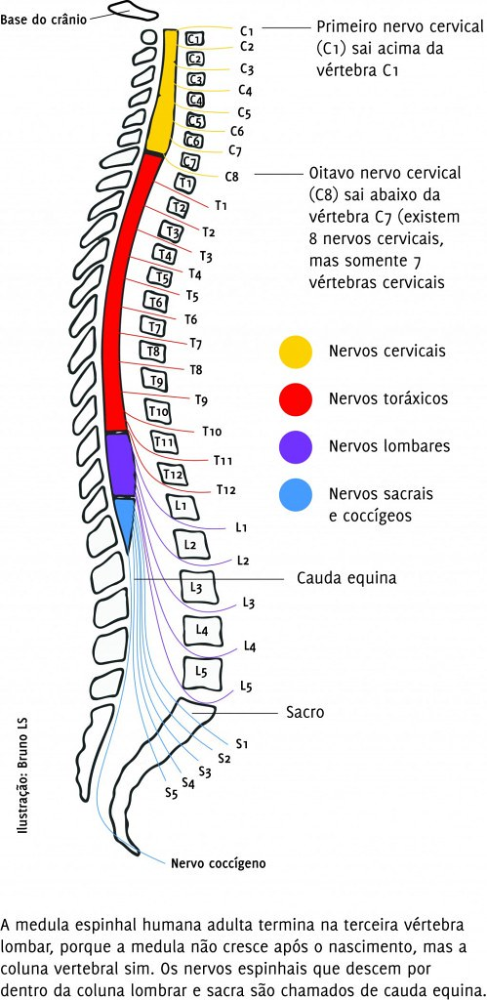
```

#### Nervos e terminações nervosas

* Fazem parte do sistema nervoso periférico, pois não estão localizados no centro
Nervos espinais
* Saem da medula espinal e enviam estímulo para o abdome e tórax

#### Medula espinal 

Faz parte do sistema nervoso central

* **Função** – Possui dupla função (motora e sensitiva). Sobe estímulo sensitivo e desce estímulo motor. É ela
que estimula o musculo diafragma e que controla o movimento do pescoço para baixo.
* **Localização** – Está localizada no interior do canal vertebral
* **Definição** – é uma haste de tecido nervoso do sistema nervoso central que está no interior da coluna vertebral
* **Tamanho** – Aproximadamente 44 cm de comprimento
* **Limites**:
  * **Superior** – é onde começa, no forame magno e C1
  * **Inferior** – é onde termina, na segunda vertebra lombar – L2
* **Cor** – Branca por fora (neurônios com mielina, passa mais rápido) e cinza por dentro (neurônios sem mielina, passa mais lento).
* **Partes** – Cone medular, cauda equina, filamento terminal, plexo cervical, plexo braquial e plexo lombosacral
* **Nervos espinais** – 31 pares, nasce na coluna cevicais

#### Partes da medula espinal

* **Plexo cervical** – São nervos presentes na região cervical
* **Nervo Frênico** – Nervo da C4 que passa sob o escaleno anterior e o musculo guia é o escaleno anterior
* **Torácico longo** – nervo que nasce na C7 e passa sob a caixa torácica
* **Plexo Braquial** - Levam estímulos para os membros superiores, nasce no final da cervical e começo da
torácica
* **Plexo lombosacral** - Nasce na lombar e vai para o sacro, enviam estímulo para a pelve e membros inferiores
* **Cone medular** - Fica no final da medula em L2
* **Filamento terminal** - Fio branco que se estende até o final, originado da piamater
* **Cauda equina** - Conjunto do plexo lombosacral mais filamento terminal

### Doenças Relacionadas ao Sistema Nervoso

#### Tetraplegia

* Lesão da cervical para baixo;
* Quando a lesão é muito alta pega o nervo frênico que irá afetar o diafragma.

### Paraplegia

* Lesão dorsal baixa da 6º a 12º vertebra Neurônios;

#### Esclerose Múltipla

* Doenças que são **desmielinizantes**, destroem a bainha de mielina. É uma doença progressiva e sem medicações.

#### Tronco encefálico
* Está localizado na frente do vermis, cobrindo-o
* Dividido em 3 partes
  * **Mesencéfalo** – é o buraquinho responsável pela reação de proteção ocular e auditiva
(reflexo)
  * **Ponte** – Parece duas bolinhas, tem relação com as mímicas faciais
  * **Bulbo** – parece uma caldinha, responsável pelo controle dos batimentos cardíacos e frequência respiratória, também tem relação com o vomito.

### Cérebro

* Possui 2 hemisférios (direito e esquerdo) e estão separados por uma fissura chamada fissura longitudinal do cérebro
* O cérebro possui os lobos
  * **Externo** – frontal, occipital, parietal e temporal;
  * **Interno** – ínsula (está isolado dos outros), faz parte do sistema límbico e é responsável pelas emoções

#### Sistema límbico 

* Amigdala, hipotálamo, giro cíngulo e lobo da ínsula
  
#### Corpo caloso

  * Principal meio de união entre os hemisférios cerebrais

#### Meninges

* São membranas concêntricas (camadas, uma dentro da outra) que revestem o sistema nervoso central
* São divididas em 3:
  * **Duramater** - externa;
  * **Aracnóide** – intermediaria; e
  * **Piamater** - interna.

#### Nervos cranianos

I. Olfatório (nariz)  
II. Óptico (enxergar)  
III. Oculomotor (movimentar os olhos)  
IV. Troclear (faringe)  
V. Trigêmeo (face)  
VI. Abducente (língua)  
VII. Facial (rosto)  
VIII. Vestíbulo coclear (orelha)  
IX. Glossofaríngeo (língua e faringe)  
X. Vago (tórax, diafragma e abdome)  
XI. Acessório (pescoço)  
XII. Hipoglosso (mexer a língua  

### Anotações Adicionais

* A medula está localizada no interior <amarelo>??QUAL PALAVRA???</amarelo> vertebral;
* Lesão
  * Quanto mais superior (alta) **TETRAPLEGIA**;
  * Quanto mais inferior (baixa) **PARAPLEGIA**;
* A medula controla os movimentos **do pescoço para baixo**
* É uma parte do tecido nervoso do sistema nervoso central que está no interior da coluna vertebral
* A medula possui, aproximadamente, 44 cm de tamanho
* A medula começa no **forâme magno** (C1) e termina na L2
* A cor da medula é branca por fora e cinza por dentro

### <amarelo>Nomes de Estruturas ( verificar o que são com a professora )</amarelo>

* Cone Medular
* Cauda Esquina
* Filamento Terminal
* Plexo Braquial
* Plexo Lombo Sacral

## Nota de Aula nº 07

|Data|Tópicos Abordados|Colaborador|Link|
|:--|:--|:---|:---|
|10/10/2022|- Sistema Circulatório: Definição;Localização;Forma;Peso;Camadas;Configuração Interna;Alguns Vasos|Daniel Claudino|Versão inicial|
|03/10/2022|Notas de aula disponibilizada.<br>- Sistema Circulatório: Definição;Localização;Forma;Peso;Camadas;Configuração Interna;Alguns Vasos|Daniel Souza|[Link para Download](https://bit.ly/3ruv6mM)|

### Sistema Circulatório

```{r echo=FALSE, fig.show="hold", out.width="90%", fig.align = "center", fig.cap="O Coração"}
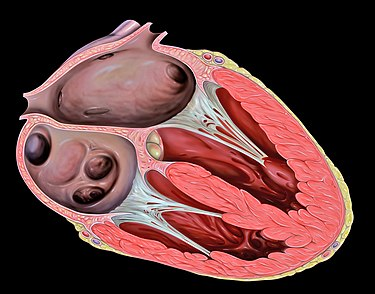
```

### Anotações iniciais

* O **sistema circulatório** também é chamado de **sistema cardiovascular**.

### Coração

#### Definição

* É um órgão muscular que funciona como uma bomba. É formado por tecido muscular esquelético involuntário chamado MIOCÁRDIO.

#### Localização

* Situado na caixa toráxica, com dois terços voltados para o lado esquerdo;
* Posteriormente do osso esterno
* A frente da coluna vertebral;
* Acima do músculo diafragma
* Entre os dois pulmões (Mediastino = espaço entre os dois pulmões);

#### Forma

* Ele tem a forma de uma **TRIÂNGULO INVERTIDO**
* Com **ÁPICE** voltado para
  * Baixo
  * Frente
  * Esquerda
* Com a **BASE** voltada para
  * Cima
  * Trás
  * Direira
* O coração está **OBLIQUAMENTE INCLINADO**

#### Peso

Por questões hormonais:

* Homem: 300g
* Mulher: 270g 

#### Camadas

* EXTERNA
  * Pericárdio ( 1 camada só )
    * Parietal
    * Visceral
* INTERMEDIÁRIA
  * Miocárdio
* INTERNA
  * Endocárdio

#### Configuração Interna

```{r echo=FALSE, fig.show="hold", out.width="90%", fig.align = "center", fig.cap="Bombeamento do Coração"}
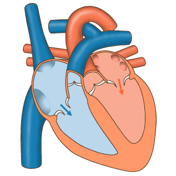
```

* O coração possui 4 compartimentos
  * Dois ÁTRIOS
    * O SEPTO INTERATRIAL é a parede entre os dois átrios
  * Dois VENTRÍCULOS
    * O SEPTO VENTRICULAR é a parede entre os dois ventrículo
* O ÁTRIO DIREITO possui comunicação com o VENTRÍCULO DIREITO
  * O orifício que comunica o átrio do ventrículo chama-se ÓSTIO
  * O ÓSTIO(DIREITO) possui 03 VÁLVULAS que forma a VALVA TRICÚSPIDE
* O ÁTRIO ESQUERDO possui comunicação com o VENTRÍCULO ESQUERDO
  * O orifício que comunica o átrio do ventrículo chama-se ÓSTIO
  * O ÓSTIO(ESQUERDO) possui 02 VÁLVULAS que forma a VALVA BICÚSPIDE (MITRAL)
* A FUNÇÃO DAS VALVAS é impedir o retorno do sangue dos VENTRÍCULOS para os ÁTRIOS

**Observações**: Cúspide = prega

#### Tipos de Vasos e Cores Esquematicas

* Esquemáticamente:
  * As ARTÉRIAS possuem COR VERMELA
  * As VEIAS possuem COR AZUL ( realmente azuladas )

#### Exceção
 
 * Única ARTERIA (AZUL) que leva SANGUE VENOSO para os PULMÕES -> Artéria Pulmonar
 * São Quatro (duas de cada pulmão) as VEIAS (PULMONARES) que trazem sangue ARTERIAL dos PULMÕES

#### Vasos Importantes

* Vasos coronarianos
  * Vasos externamente localizados no coração 

* Veias Importantes
  * Cava Inferior
  * Cava Superior
  * Pulmonar
  * Subclávia
  * Basílica
* Artérias Importantes
  * Aorta
  * Femural
  * Subclávia
  
#### Características das veias e artérias

* Artéria
  * Mais grossa
  * Mais profunda
  * São centrifugas
  * Conduzem o sangue arterial ( rico em O<sub>2</sub>), exceto a ARTÉRIA PULMONAR
* Veia
  * Mais Fina
  * Mais Superficial
  * São centrípetas
  * Conduzem o sangue VENOSO ( rico em CO<sub>2</sub> ), exceto as QUATRO VEIAS PULMONARES

## Nota de Aula nº 08

|Data|Tópicos Abordados|Colaborador|Link|
|:--|:--|:---|:---|
|10/10/2022|- Sistema Respiratório|Daniel Claudino|Versão inicial|
|10/10/2022|Notas de aula disponibilizada.<br>- Sistema Respiratório|Daniel Souza|[Link para Download](https://bit.ly/3TnJbOH)|

### Sistema Respiratório

<p align="center"> 
</img><br>
<b>Figura</b> - Foto do Quadro - Esquema do Sistema Respiratório
</p>

```{r echo=FALSE, fig.show="hold", out.width="90%", fig.align = "center", fig.cap="Foto do Quadro - Esquema do Sistema Respiratório"}
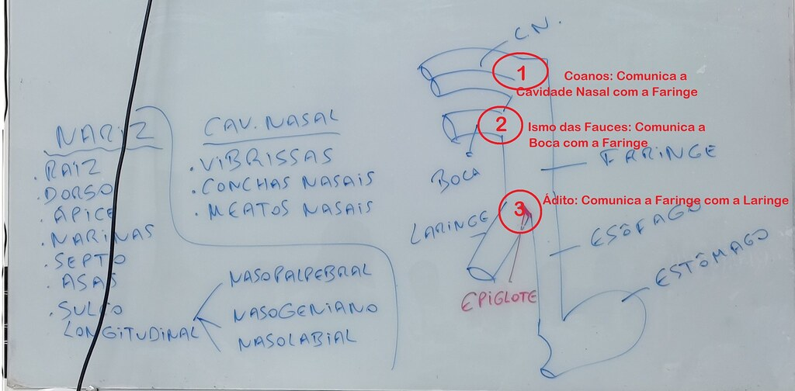
```

#### Nariz Interno ou Cavidade Nasal

* **Vibrissas** (cílios ou pêlos) 
  * Encontram-se no início da cavidade nasal e possui três funções: 
    1. filtrar o ar inspirado
    2. aquecer o ar inspirado
    3. umidificar o ar inspirado 
* **Conchas nasais **(elevações)
  * Superior / média / inferior 
* **Meatos nasais** (espaços entre as conchas) 
  * Superior / médio / inferior

#### Faringe

* É um tubo por onde passa **AR** e **ALIMENTO**;
* Possui um estrutura chamada EPIGLOTE que dirige o AR e o ALIMENTO, respectivamente para a LARINGE e o ESÔFAGO.

#### Laringe

<p align="center"> 
</img><br>
<b>Figura</b> - Laringe
</p>

```{r echo=FALSE, fig.show="hold", out.width="90%", fig.align = "center", fig.cap="Laringe"}
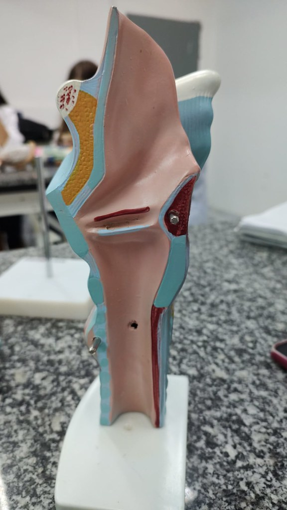
```

* Epiglote
  * É uma cartilagem da laringe
* Glote
  * É a **ÁREA** que compreende:
    * Prega vestibular
    * Ventrículo
    * Prega Vocal
* Prega Vestibular
  * Ela tem função de LIMPEZA
  * Ela está localizada superiormente a PREGA VOCAL
* Ventriculo da Laringe
  * É o espaço compreendido entre as pregas VESTIBULAR e VOCAL
* Prega Vocal ( Voz )
  * Sua função é essencial para o aparelho fonador
  * Vibra para a emissão da Voz

#### Traquéia

```{r echo=FALSE, fig.show="hold", out.width="90%", fig.align = "center", fig.cap="Caixa Toráxica - Enfase na Traquéia"}
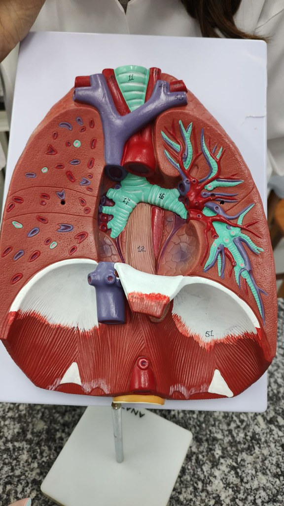
```

* É um órgão tubular;
* ANTERIORMENTE: 
   *  Formado por semianéis e ligamentos (**LIGAMENTOS ANULARES**), alternadamente;
* POSTERIORMENTE
   *  Constituído por pelo MÚSCULO TRAQUEAL;
* A PARTE FINAL DA TRAQUÉIA é chamada de BIFURCAÇÃO DA TRAQUÉIA
  * Bronquio DIRETO
    * Características
      * Mais grosso
      * Mais curto
      * Mais vertical
  * Bronquio ESQUERDO
    * Características
      * Mais Fino
      * Mais Longo
      * Mais Horizontal

#### Pulmão

```{r echo=FALSE, fig.show="hold", out.width="90%", fig.align = "center", fig.cap="Caixa Toráxica - Enfase na Traquéia"}

```

* Fissuras: Divide o pulmão em COMPARTIMENTOS chamados de LOBOS (Superior, Médio e Inferior);
  * Pulmão Direito
    * Fissura Horizontal
    * Fissura Oblíqua
  * Pulmão Esquerdo
    * Fissura Oblíquoa
* Incisura Cardíaca
* Língula: Parte inferior da incisura cardíaca
* Ápice
* Base
