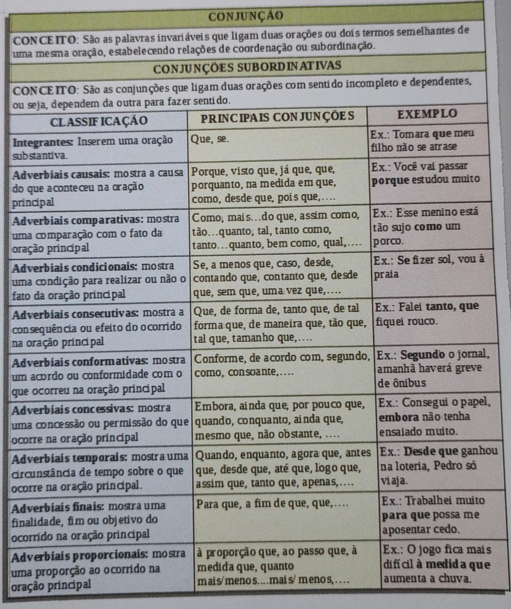

# P1 - Leitura e Produção Textual

Neste capítulo estarão contidas as notas de aula da disciplina Leitura e Produção Textual.

|Data|Tópicos Abordados|
|:--|:--|
|16/08/2022|- Funções da Linguagem|
|11/10/2022|- Conjunções subordinadas adverbiais|


## Notas de Aula de 18/08/2022

### Elementos da Comunicação

A comunicação possui 6 elementos. Quando a comunicação é **focada/centrada** em um desses elementos, ela exerce uma das **funções da linguagem* relacionada, conforme descrito abaixo.

Num mesmo ato de comunicação podemos encontrar várias funções de linguagem presentes, mas sempre haverá a predominância de uma delas (funções da linguagem).

| Elemento | Definição | Função da Linguagem Relacionada | Características da Função da Linguagem|
|:------------|:-----------|:----------------|:---------------|
| Emissor | Alguém que emite a mensagem. Pode ser uma pessoa, um grupo, uma empresa, uma instituição.| Função Emotiva / Expressiva | - Foco na 1º Pessoa <br> - Linguagem Emotiva <br> - Preocupação com o Eu <br> - Está relacionado a emoção e ao sentimento <br> **Exemplo**: crônica lírica, canções.|
| Receptor ou destinatário | A quem se destina a mensagem. Pode ser uma pessoa, um grupo ou mesmo um animal, como um cão, por exemplo. | Função Conativa ou Apelativa | - Centrado no Receptor; <br> - Objetiva mobilizar a atenção do receptor, convencê-lo, produzindo apelo ou ordem por meio de verbos imperativo;<br>**Exemplo:** É comum nos anúncios, publicidades e nas propagandas por ser volitiva e/ou imperativa; |
| Código | É o signo linguístico. <br> <br> A maneira pela qual a mensagem se organiza. O código é formado por um **conjunto de sinais, organizados de acordo com determinadas regras**, em que cada um dos elementos tem significado em relação com os demais. Pode ser a língua, oral ou escrita, gestos, código Morse, sons etc. O código deve ser de conhecimento de ambos os envolvidos: emissor e destinatário. <br>- Ex. Alfabeto da língua portuguesa. | Função Metalinguística | - É a mensagem que fala de sua própria produção.<br> - É o código falando do próprio código.<br> **Exemplos**: <br> a) Dicionário.<br>b) Texto que fala como é escrever  |
| Canal de comunicação | É o meio pelo qual a mensagem é transmitida. Ex: Voz, papel, vidro. <br> <br> Meio físico ou virtual, que assegura a circulação da mensagem, por exemplo, ondas sonoras, no caso da voz. O canal deve garantir o contato entre emissor e receptor. | Função Fática | - Usada principalmente na linguagem oral;<br> - Checa e mantém a conexão entre o emissor e o receptor, muitas vezes, sem carga semântica.<br> - Discurso Direto<br> - Cumprimentos padrões, por exemplo. |
| Mensagem | É o objeto da comunicação, é constituída pelo conteúdo das informações transmitidas. |  Função poética | - Quando a própria mensagem é colocada em destaque, seja por meio dos desvios da norma ou de novas combinações da linguagem objetiva, para produzir, principalmente, um efeito estético.<br>- Uso de figuras de linguagem; <br> - Subjetividade | 
| Referente | O contexto, a situação aos quais a mensagem se refere. O contexto pode se constituir na situação, nas circunstâncias de espaço e tempo em que se encontra o destinador da mensagem. Pode também dizer respeito aos aspectos do mundo textual da mensagem. | Função Referencial ou Denotativa | - Tem por objetivo informar algo.<br>- Usa Denotação.<br>- Descreve elementos do mundo<br>- Usa linguagem objetiva <br><br>Ex. Textos jornalísticos, reportagem, textos legais |

> **Observação sobre os termos Denotação e Conotação**:
> > Denotação: Sentido do dicionário.
> > Conotação: Sentido figurado.
> 1) Livro Disponibilizado pela Professora na Plataforma na Aula de 16.08.2022 ( **Leitura e produção textual I** );
> 2) Slide Disponibilizado pela Professora na Plataforma na Aula de 16.08.2022 ( **Slide 2** )


## Notas de Aula de 11/10/2022

Foi respondido um exercício em sala com base nas conjunções subordinadas adverbiais.

```{r echo=FALSE, fig.show="hold", out.width="90%", fig.align = "center", fig.cap="Posição Anatômica e Termos Regionais"}

```